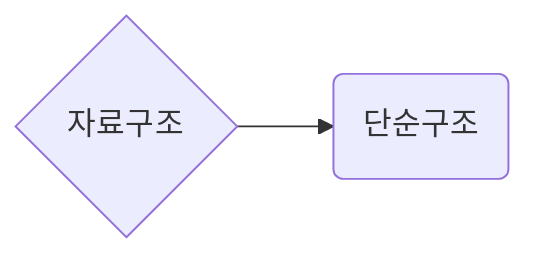

# Data_structure

```mermaid
flowchart LR
    
    A{자료구조} --> B(단순구조) 
   
```

flowchart LR
    A[Hard edge] -->|Link text| B(Round edge)
    B --> C{Decision}
    C -->|One| D[Result one]
    C -->|Two| E[Result two]
